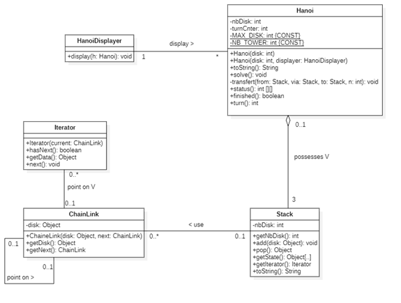

# Hanoi
HEIG Project (2020) - POO1


Ce programme implémente la résolution du problème des tours de Hanoï.
Il consiste à déplacer des disques de diamètres différents d'une tour de « départ » à une tour d'« arrivée » en passant par une tour « intermédiaire », et ceci en un minimum de coups, tout en respectant les règles suivantes :
1) On ne peut déplacer plus d'un disque à la fois.
2) On ne peut placer un disque que sur un autre disque plus grand que lui ou sur un emplacement vide.

## Auteurs

- Dylan Canton
- Mélodie Ohan

## Algorithme
L'algorithme choisit est récursif.

```
Transférer n disques du piquet O (origin) vers le piquet D (destination) via le piquet I (intermédiaire):
si n > 0 alors
    Transférer n-1 disques de O vers I via D
    Transférer le disque restant de O vers D
    Transférer n-1 disques de I vers D via O
fin si
```

## Paquetages

### Hanoi
Le paquetage Hanoi contient les classes Hanoi et HanoiDisplayer qui s'occupent de la résolution et l'affichage du problème des tours de Hanoï.

### Util
Le paquetage Util contient les classes Tower, ChainLink et Iterator. Ces classes s'occupent de tout ce qui est lié à la pile.

### Test
Le paquetage Test contient les classes TestHanoi et TestTower qui s'occupent de tester respectivement la résolution du problème des tours de Hanoï et les fonctionnalités de la pile (la tour).
Il contient également TestHanoiTerminal et TestChainLink qui permettent de directement tester les cas limites et de les présenter dans ce document.


## Diagramm



## Description des classes
### Hanoi
La classe Hanoi permet la résolution du problème des tours de Hanoï. Elle modélise 3 tours et utilise une fonction récursive pour la résolution du problème.
### HanoiDisplayer
La classe HanoiDisplayer s'occupe de l'affichage d'un problème de Hanoï.
### Tower
La classe Tower représente une des tours de Hanoï et gère l'empilement ainsi que le désempilement des disques. Elle permet également de récupérer son état (nombre et tailles de disques), un itérateur sur le disque au sommet et d'afficher sa composition.
### ChainLink
La classe ChainLink représente un maillon d'une liste chaînée de disques. Le maillon possède un objet (le disque) et une référence sur le prochain maillon.
### Iterator
La classe Iterator permet de représenter un itérateur sur un maillon, cela est utile afin de parcourir la liste chainée. 
